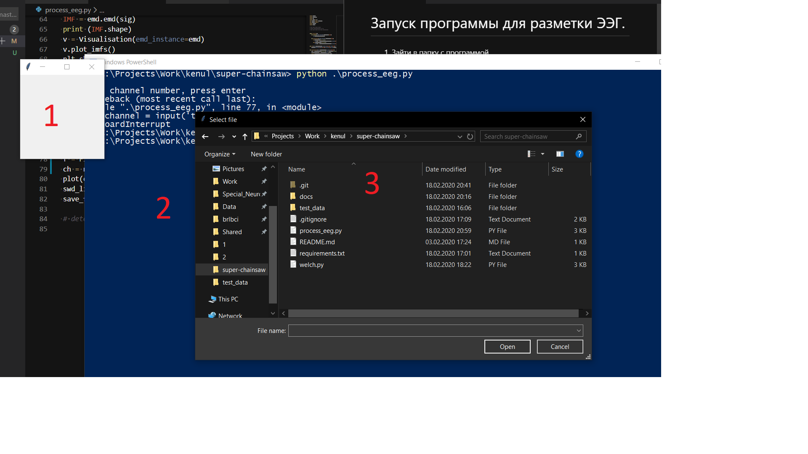
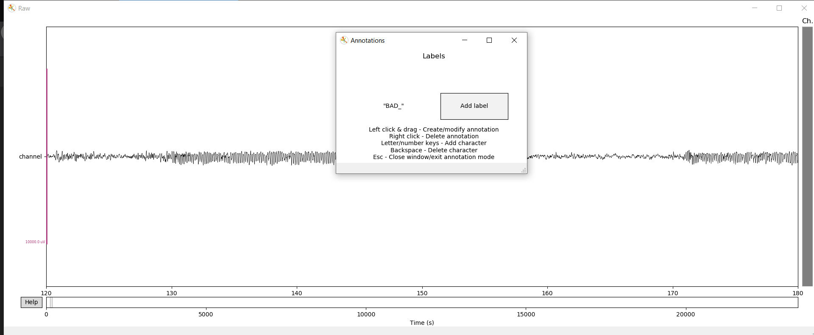
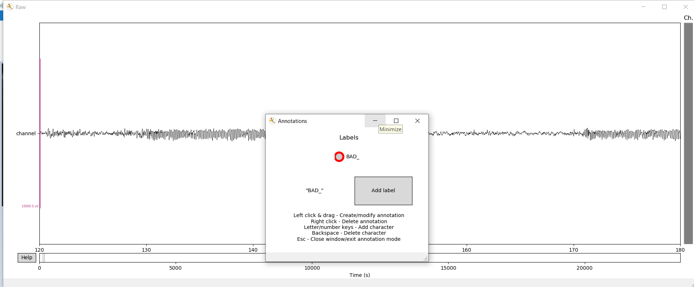
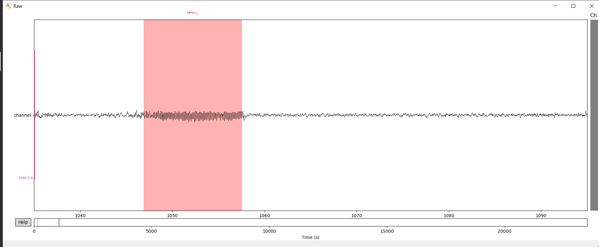
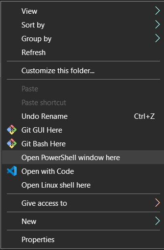

## Инструкция по использованию программы для разметки ЭЭГ.

1. Зайти в папку с программой
2. Двойной клик на файле `process_eeg.py`
3. Открывается диалог выбора файла, пустое окно и консоль.

4. Выбрать нужный файл. Окно выбора закроется, после этого нужно ввести номер интересуещего канала в в консоли, нажать enter.

5. Откроется окно с ЭЭГ. Нажать кнопку a (английская раскладка). Откроетсся окно с выбором режима разметки.

6. Нажать `Add label`

7. Начать разметку. Добавить аннотацию - левая кнопка мыши, удалить - правая.

8. Закрыть окно с ЭЭГ.

9. Закрыть пустое окно.

10. Откроется окно выбора места сохранения файла. В одном файле находятся все swd, которые были помечены. Каждое сравниваемое условие сохранять в свою папку.

## Инструкция по использованию программы для рисования спектров

1. Открыть консоль (`Shift + правая кнопка мыши` в проводнике) - открыть Powershell здесь.

2. В консоли напечатать:
`python welch.py ПУТЬ_К_ПАПКЕ_1 ПУТЬ_К_ПАПКЕ_1`
Пути абсолютные.
3. Нажать `enter`
